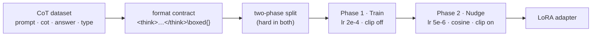

<p align="center">
  
</p>

<p align="center">
  <a href="https://github.com/DaoyuanLi2816/tracedistill/actions/workflows/ci.yml"></a>
  <a href="https://pypi.org/project/tracedistill/"></a>
  
  
  <a href="https://www.kaggle.com/competitions/nvidia-nemotron-model-reasoning-challenge"></a>
</p>

<h1 align="center">tracedistill</h1>

<p align="center"><b>Distill teacher chains-of-thought into a LoRA adapter — so a model re-derives every answer itself, where no code may run.</b></p>

`tracedistill` is the generalized core of team **VCDAD**'s **silver-medal** solution to the
[NVIDIA Nemotron Model Reasoning Challenge](https://www.kaggle.com/competitions/nvidia-nemotron-model-reasoning-challenge)
(**65 / 4182, Top 1.6%**), extracted into a small, tested library you can run on your own
data. The medal-winning code is preserved verbatim in [`competition/`](competition/) and
[pinned to this library byte-for-byte](tests/) by golden tests.

Give it `(problem, teacher chain-of-thought, answer)` triples and it trains a LoRA adapter
that **reasons step-by-step and then emits a parseable `\boxed{}`** — the recipe for tasks
where the grader can't run your code, so the solving procedure has to live inside the
model's own chain-of-thought.

---

## Why not just `SFTTrainer` on your traces?

Four design choices, each implemented as a library piece:

1. **A strict format contract** ([`formatting.py`](src/tracedistill/formatting.py)). The SFT
   target is built byte-for-byte identical to the eval protocol —
   `<think> … </think>\boxed{answer}` — and the reasoning (from the teacher trace) is
   **decoupled** from the final answer (rewritten with the *authoritative* label). Train
   input ≈ eval input, so the model reliably boxes a correct answer instead of trailing off.
2. **Two-phase `Train → Nudge`** ([`training.py`](src/tracedistill/training.py)). A hard,
   fast pass (high LR, clipping off) for broad coverage, then a tiny continuation (1/40 LR,
   cosine, clipping on) that squeezes the hard problem types while a balanced sprinkle of
   *fresh* easy data prevents catastrophic forgetting.
3. **Type-stratified batching** ([`sampling.py`](src/tracedistill/sampling.py)). With a tiny
   effective batch, a naive shuffle can make a whole batch one problem type and swing the
   gradient. A round-robin "deal the cards" order keeps every effective batch type-balanced.
4. **Architecture-aware LoRA** ([`lora.py`](src/tracedistill/lora.py)). The competition base
   is a hybrid **Mamba-2 + MoE** model, so targets cover the SSM `in_proj/out_proj` *and*
   attention *and* MLP — the detail a vanilla Llama recipe misses.



## Install

```bash
pip install tracedistill            # light core: numpy / pandas / pyyaml
pip install "tracedistill[train]"   # + torch / transformers / trl / peft / datasets to train
```

The core (`build_records`, the stratified order, the split, target selection, config) is
**torch-free** — it imports and unit-tests without a GPU stack.

## 60 seconds

```python
import tracedistill as td

# Your data: a DataFrame (or list of dicts) with prompt / generated_cot / answer / type.
records, types = td.build_records(df)      # the <think>…</think>\boxed{} format contract
order = td.build_stratified_index_order(types, batch_size=8, seed=42)  # type-balanced order
targets = td.target_modules_from_model(model)   # attention + Mamba SSM + MLP, auto-detected

# The two non-overlapping training sets for Train → Nudge:
phase1_df, phase2_df = td.two_phase_split(df, hard_types=["cryptarithm_deduce"], seed=42)
```

Full two-phase training on an already-LoRA'd model:

```python
from tracedistill import TwoPhaseConfig, PhaseConfig, train_two_phase

cfg = TwoPhaseConfig(hard_types=["cryptarithm_deduce", "cryptarithm_guess"],
                     phase1=PhaseConfig.train(), phase2=PhaseConfig.nudge())
train_two_phase(model, tokenizer, df, cfg)   # Phase 2 continues from Phase 1's weights
```

## CLI

One YAML config drives an end-to-end run (load base model → architecture-aware LoRA →
`Train → Nudge` → save / package the adapter):

```bash
tracedistill --cfg examples/configs/quickstart.yaml             # small single-GPU
tracedistill --cfg examples/configs/reproduce_competition.yaml  # the medal setup (Kaggle)
```

## Measured: does distilling the *trace* actually help? (GSM8K, one RTX 4080)

[`examples/gsm8k_trace_distillation.py`](examples/gsm8k_trace_distillation.py) runs four
arms on a **base (non-instruct) Qwen2.5-0.5B + LoRA** through the public API and scores
**boxed-answer accuracy** on held-out GSM8K (greedy, parse `\boxed{}` exactly like a
grader). A *base* model is used on purpose: it's weak at the "reason then box" protocol
zero-shot, so distilling a teacher trace has real room to help — the regime trace
distillation is built for. The only difference between *answer-only SFT* and *trace-distill*
is whether a reasoning trace sits between the `<think>` tags, so that gap isolates the value
of distilling the trace.

<p align="center">
  
</p>

| arm | boxed accuracy | parse rate | hard-problem acc (≥5 steps) |
|---|--:|--:|--:|
| zero-shot (base, no training) | 9.5% | 30% | 0% |
| answer-only SFT | **3.5%** | 100% | 0% |
| **trace-distill, 1 phase** | 33.0% | 98.5% | **6.1%** |
| **trace-distill, 2 phase (Train→Nudge)** | **35.0%** | 96.5% | **6.1%** |

**Distil the trace, not the answer.** Trace distillation lifts the weak base from **9.5% →
35.0% (≈3.7×)**. Answer-only SFT — the *same* boxed format but with **no reasoning trace** —
instead *drops* to **3.5%** (it learns to always emit a `\boxed{}`, but having been taught to
skip the reasoning, it just boxes wrong answers). The 10× gap between the two SFT arms (35.0%
vs 3.5%) is purely the reasoning trace.

**Distillation also fixes the format.** Zero-shot, the base emits a parseable `\boxed{}` only
30% of the time; after distillation, ~97%. And ≥5-step hard problems go from **0% → 6.1%** —
only the trace-distilled arms crack any at all.

**The Nudge adds a little more.** Phase 2 edges 1-phase **33.0% → 35.0%**.

**Honest caveat.** This is a 0.5B model on GSM8K, so the absolute numbers are modest; the
result demonstrates the *relative* value of distilling the trace. It's the same recipe that
took **silver** on the competition's harder, code-derived puzzles — where the fixed base
likewise can't solve them zero-shot and the teacher trace encodes the procedure.

**Provenance of these specific numbers.** They were captured with an earlier revision of
this script's `SFTTrainer` call, before a later fix (see the git history of
[`training.py`](src/tracedistill/training.py)) that restricts the SFT loss to the assistant
turn only — the version used here also let some loss gradient fall on the user's question
text, rather than purely on the `<think>…</think>\boxed{}` span being distilled. That
applied identically to all three trained arms, so the relative story above (trace-distill
≫ answer-only, 2-phase ≥ 1-phase) is expected to hold, but the absolute percentages haven't
been re-measured since the fix and may shift on a re-run; treat them as directional rather
than final.

```bash
pip install "tracedistill[train]" datasets
python examples/gsm8k_trace_distillation.py        # ~1h on one RTX 4080 (16 GB)
```

## The competition result

On the hidden test set, the two-phase recipe on `Nemotron-3-Nano-30B-A3B` reached a
**silver medal (65 / 4182, Top 1.6%)**. ~84% of the benchmark is "free" points that almost
everyone clears (gravity, unit conversion, Roman numerals, ciphers); the ranking is decided
by two hard families — **cryptarithm** and **bit-manipulation** — which is exactly what the
two-phase `Nudge` and the hard/easy split target. See [`docs/solution.md`](docs/solution.md),
[`docs/dataset.md`](docs/dataset.md) and [`docs/model-card.md`](docs/model-card.md) for the
full methodology, and [`competition/`](competition/) for the verbatim solution.

## How it compares

| | vanilla `SFTTrainer` | `tracedistill` |
|---|---|---|
| Target format | freeform text | strict `<think>…</think>\boxed{}` contract |
| Answer source | as written in the trace | decoupled — official label re-boxed |
| Schedule | single pass | two-phase `Train → Nudge` |
| Batching | shuffle | type-stratified round-robin |
| LoRA targets | attention (+ MLP) | + **Mamba-2 SSM** `in_proj/out_proj` |

## Provenance & validation

- [`competition/`](competition/) — the original silver-medal solution, **unmodified**.
- [`tests/`](tests/) — **golden tests**: `tests/reference_impl.py` holds verbatim copies of
  the competition's `build_records` / `build_stratified_index_order`, and the suite asserts
  `tracedistill` reproduces them **byte-for-byte** over hundreds of fuzzed cases. 48 tests,
  torch-free, run in well under a second.

The official Kaggle **Certificate of Achievement** — Silver Medalist, 65th of 4182 teams:

<p align="center">
  <a href="https://www.kaggle.com/certification/competitions/distiller/nvidia-nemotron-model-reasoning-challenge"></a>
</p>

## Citation

```bibtex
@misc{li2026tracedistill,
  title  = {tracedistill: Two-Phase LoRA Trace-Distillation for Reasoning Models},
  author = {Li, Daoyuan},
  year   = {2026},
  note   = {Silver medal (65/4182), NVIDIA Nemotron Model Reasoning Challenge},
  url    = {https://github.com/DaoyuanLi2816/tracedistill}
}
```

## License

[MIT](LICENSE). The license covers the code and documentation in this repository; it does
**not** extend to the competition data or the base model, which remain under their
respective terms (see [`data/README.md`](data/README.md)).
