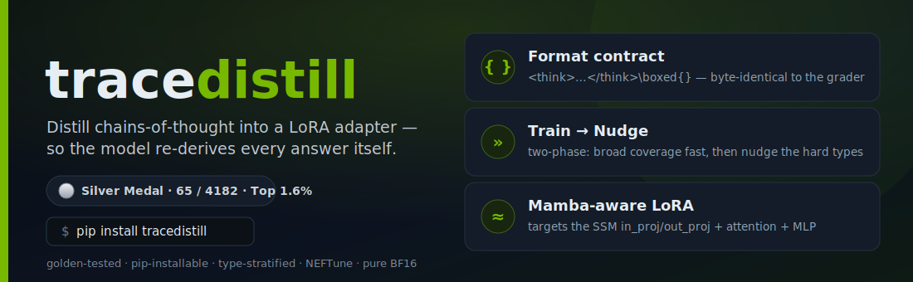
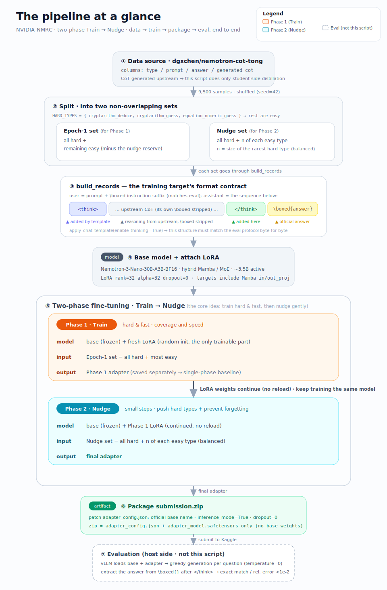

<p align="center">
  
</p>

<h1 align="center">NVIDIA Nemotron Model Reasoning Challenge — Silver Medal Solution</h1>

<p align="center">
  <a href="https://www.kaggle.com/competitions/nvidia-nemotron-model-reasoning-challenge"></a>
  
  
  
  
  
</p>

> Team **VCDAD**'s solution to the [NVIDIA Nemotron Model Reasoning Challenge](https://www.kaggle.com/competitions/nvidia-nemotron-model-reasoning-challenge) (Kaggle, 2026). We fine-tune a single **rank-32 LoRA adapter** on the frozen `NVIDIA-Nemotron-3-Nano-30B-A3B` base model and distill deterministic, step-by-step reasoning traces into it — so the model **re-derives every answer itself at eval time, where no code may run**.

**🥈 Silver Medal — 65th out of 4163 teams (Top 1.6%).**

---

## TL;DR

The competition fixes one shared base model for everyone and asks you to raise its accuracy on a brand-new benchmark of program-generated reasoning puzzles. You don't submit predictions — you submit a **LoRA adapter** (`rank ≤ 32`), and the host runs it through **vLLM** on a hidden test set. The catch: **the grader cannot execute code**, so any solving algorithm has to live *inside the model's chain-of-thought*.

Our recipe:

1. **Trace-distillation SFT** — wrap each problem's worked-out chain-of-thought into the exact `<think> … </think>\boxed{answer}` format the grader expects, and SFT it into the adapter.
2. **Two-phase `Train → Nudge`** — a hard, fast first pass (lr `2e-4`, gradient clipping *off*) to cover all problem types, then a tiny second pass (lr `5e-6`, cosine, clipping back *on*) focused on the hard types, with a balanced sprinkle of fresh easy problems to prevent catastrophic forgetting.
3. **Architecture-aware LoRA** — because the base is a **hybrid Mamba-2 + MoE** model, we attach LoRA to the Mamba `in_proj/out_proj` *and* attention `q/k/v/o_proj` *and* MLP `up/down_proj`, not just attention.
4. **Training hygiene tuned to the task** — a custom round-robin **stratified sampler** (every effective batch is type-balanced), **NEFTune** noise to fight the puzzles' adversarial flavor text, and pure **BF16** (no quantization) so the traces are reproduced precisely.

The full annotated pipeline is one script: **[`code/training.py`](code/training.py)**. The in-depth write-ups (Chinese) are in **[`docs/`](docs/)**.

---

## The competition in 60 seconds

| | |
|---|---|
| **Goal** | Improve a fixed model's reasoning accuracy on a novel benchmark — no model swapping allowed. |
| **Base model** | [`NVIDIA-Nemotron-3-Nano-30B-A3B-BF16`](https://huggingface.co/nvidia/NVIDIA-Nemotron-3-Nano-30B-A3B-BF16) — hybrid **Mamba-2 + MoE**, 30B total / ~3.5B active, native `<think>` reasoning, 1M context. |
| **Submission** | A `submission.zip` containing only `adapter_config.json` + `adapter_model.safetensors` (LoRA, `rank ≤ 32`). No base weights. |
| **Eval** | Host runs the adapter via vLLM (`temperature=0`, `max_tokens=7680`, `max_model_len=8192`). One greedy generation per question — **no retries, no voting**. |
| **Metric** | Accuracy. Answer is read from `\boxed{}`; correct if it matches ground truth exactly (string) **or** within `1e-2` relative tolerance. |
| **Data** | 9,500 program-generated puzzles across **7 families** (9 subtypes). ~84% are "free" points; the ranking is decided by two hard families. |

### Why it's not a normal SFT task

- **The grader can't run Python.** Solving the training puzzles locally with code is worthless — the *solving procedure itself* has to be distilled into the model so it reproduces it in its trace.
- **8192-token context, 7680-token generation cap** on a model that natively does 1M. On token-heavy puzzles (binary strings, symbol soups) "can the reasoning fit in the budget?" matters as much as "is it correct?" → HEX compression, signature tables, *memorize-vs-compute* trade-offs.
- **MoE → noisy scores.** Even at `temperature=0`, expert routing + float accumulation make repeated evals of the *same* adapter wobble. → trust **local stratified CV**, not the public LB.
- **One shot per question.** No self-consistency at eval time, so verification/back-tracking must be written *into* the trace.

---

## Our approach in detail



### 1. The format contract (the one thing you must not break)

The single most fragile, highest-leverage piece of the solution is the SFT target format. It is built to be **byte-for-byte identical to the eval protocol** so the model reliably emits a parseable `\boxed{}`:

```python
# code/training.py — build_records()
cot_cleaned  = re.sub(r'\\boxed\{[^}]*\}', '', cot).rstrip()          # strip the upstream CoT's own \boxed
user_content = str(row["prompt"]) + PROMPT_SUFFIX                      # prompt + the grader's exact suffix
asst_content = cot_cleaned + f"\n</think>\n\\boxed{{{row['answer']}}}" # reattach the OFFICIAL answer
```

The final training target looks like:

```
<think>                       ← added automatically by the chat template (enable_thinking=True)
(reasoning trace, with its original \boxed stripped)
</think>                       ← added by build_records
\boxed{official answer}        ← added by build_records (authoritative answer, not the upstream one)
```

This **decouples the reasoning (from the upstream CoT) from the final answer (from the official label)**, and makes the structure match exactly what the grader parses.

### 2. Two-phase fine-tuning: `Train → Nudge`

Both phases train on the **same** model object (Phase 2 continues from Phase 1's weights). The hard families — `cryptarithm_deduce`, `cryptarithm_guess`, `equation_numeric_guess` — appear in **full** in both phases; the easy families are split into two non-overlapping halves so Phase 2 sees *fresh* easy data.

| Hyper-parameter | Phase 1 · Train | Phase 2 · Nudge | Why |
|---|---|---|---|
| Learning rate | `2e-4` | `5e-6` (**40× smaller**) | Phase 2 only *nudges* |
| Scheduler | linear | cosine | smooth cooldown |
| Warmup | 0 | 10 | stability in the fine pass |
| `max_grad_norm` | `1e9` (clipping **off**) | `1.0` (clipping **on**) | Phase 1 is aggressive, Phase 2 is safe |
| Data | hard (all) + most easy | hard (all) + a balanced few easy | Phase 2 focuses on hard types |
| NEFTune | 5.0 | 5.0 | identical |

> **Phase 1** slams the traces into the adapter to get broad coverage fast (rough but complete). **Phase 2** spends a 1/40 learning rate squeezing out a few more points on the hard types, while a balanced sprinkle of fresh easy problems anchors against catastrophic forgetting. One phase owns coverage & speed; the other owns precision & stability.

### 3. Architecture-aware LoRA targets

```python
TARGET_MODULES = ["q_proj","k_proj","v_proj","o_proj",   # attention
                  "in_proj","out_proj",                   # Mamba-2 (SSM) projections ← not in a vanilla Llama recipe
                  "up_proj","down_proj"]                  # MoE / MLP
LORA_RANK = 32     # hard cap, maxed out for capacity to "memorize" rule tables
LORA_DROPOUT = 0.0 # distillation wants to reproduce traces precisely
```

Covering the Mamba `in_proj/out_proj` (alongside attention and MLP) is the key detail for fine-tuning this hybrid architecture.

### 4. Stratified sampler + NEFTune

- **Round-robin stratified sampler** — with effective batch size 8 (`batch=1 × grad_accum=8`), a naive shuffle could make a batch all-one-type and swing gradients. We precompute a type-balanced order ("deal the cards") and feed it through a minimal `PrecomputedOrderSampler`, overriding only `get_train_dataloader` — no hacking of TRL internals.
- **NEFTune (`α=5.0`)** — the puzzles are wrapped in adversarial flavor text ("Alice's Wonderland", misleading operator symbols). NEFTune's embedding noise pushes the model to grab the *real* rule through the noise instead of memorizing surface strings. It pairs deliberately with `dropout=0`: **memorize the abstract rule, forget the specific flavor text.**

---

## Where the points are: the "0.86 wall"

| Family | Count | Top-tier solve rate | Role |
|---|--:|--:|---|
| gravity | 1597 | 100% | free |
| unit conversion | 1594 | 100% | free |
| numeral system (Roman) | 1576 | 100% | free |
| text cipher | 1576 | ~99–100% | free |
| bit manipulation | 1602 | ~93–97% | ⭐ battleground |
| equation numeric | 732 | deduce ~95% / guess ~50% | medium |
| cryptarithm | 823 | deduce ~30% / guess ~10% | ⭐⭐ decider |

The easy families plus the easy part of bit-manip add up to ~84% — roughly a **0.85–0.86** score that almost everyone reaches. The 0.86 → 0.89 jump comes **almost entirely from `cryptarithm` and `bit manipulation`**, which is where the real engineering (HEX compression to save tokens, *signature tables* to turn brute-force search into table lookup, in-trace verification) goes. See [`docs/dataset.md`](docs/dataset.md) for a full breakdown of every family, including worked `deduce` vs `guess` examples.

---

## Repository layout

```
nvidia-nemotron-reasoning-challenge/
├── code/
│   └── training.py        # the full annotated two-phase fine-tuning pipeline (single script)
├── docs/
│   ├── solution.md        # 解决方案 — end-to-end solution walkthrough (Chinese)
│   ├── dataset.md         # 数据集详解 — all 7 puzzle families, rules & examples (Chinese)
│   ├── model-card.md      # 模型介绍 — the Nemotron-3-Nano-30B-A3B base model explained (Chinese)
│   ├── pipeline.svg       # the solution flowchart
│   ├── banner.svg         # repo masthead
│   └── solution.pdf       # the full write-up as a single PDF
├── data/
│   ├── train.csv          # official competition training set (9,500 rows: id, prompt, answer)
│   ├── test.csv           # the small sample test file (format-debugging only)
│   └── README.md          # data fields + where the real training data comes from
└── README.md
```

## Reproducing

The script targets the **Kaggle** environment for this competition (a Blackwell GPU, offline). The notable engineering details (and why they exist):

1. **Offline install** of Triton / `unsloth` / `trl` / `peft` / `mamba_ssm` / `causal_conv1d` from mounted wheel datasets — the eval box has no internet.
2. **Blackwell `ptxas` patch** — swaps in a Blackwell-capable `ptxas` and monkey-patches Triton's version check (the model shipped 2025-12, ahead of a mature toolchain on new hardware).
3. **Data** — `training.py` reads the third-party CoT dataset, **not** the official `train.csv`:
   - Base data & model: [competition page](https://www.kaggle.com/competitions/nvidia-nemotron-model-reasoning-challenge) · [model](https://www.kaggle.com/models/metric/nemotron-3-nano-30b-a3b-bf16)
   - Offline wheels: [`mayukh18/nemotron-packages`](https://www.kaggle.com/datasets/mayukh18/nemotron-packages)
   - CoT training data (adds a `type` + `generated_cot` column): [`dgxchen/nemotron-cot-tong`](https://www.kaggle.com/datasets/dgxchen/nemotron-cot-tong)
4. Run `code/training.py` top-to-bottom (it's authored as Jupyter `# %%` cells). It produces `submission.zip` containing the two required adapter files.

---

## 中文简介

这是 **VCDAD 队** 在 Kaggle [NVIDIA Nemotron Model Reasoning Challenge](https://www.kaggle.com/competitions/nvidia-nemotron-model-reasoning-challenge) 的银牌方案（**65 / 4163，Top 1.6%**）。

比赛要求在一个**所有人共用的固定基座模型**（`Nemotron-3-Nano-30B-A3B`，混合 Mamba-MoE 架构）之上，微调一个 **rank ≤ 32 的 LoRA adapter** 来提升其在程序生成推理谜题上的准确率。核心约束是**评测端不能跑代码**——解题算法必须蒸馏进模型，让它在 7680 token 的思维链里自己把答案算出来。

本方案的核心是**两阶段轨迹蒸馏 SFT（Train → Nudge）**：

- **格式契约**：把训练目标拼成与评测协议逐字一致的 `<think>…</think>\boxed{官方答案}`，并把"推理过程（用上游 CoT）"与"最终答案（用官方标签）"解耦。
- **Train → Nudge**：Phase 1 用大学习率（2e-4）+ 关闭梯度裁剪大力铺开所有题型；Phase 2 用 1/40 学习率（5e-6）+ cosine + 重开裁剪，在难题为主、类型均衡的小集合上精修，并掺入新鲜易题防遗忘。
- **架构感知 LoRA**：覆盖 Mamba 的 `in_proj/out_proj`，而非只挂 Attention。
- **训练工程**：round-robin 分层采样器（每个等效 batch 类型均衡）+ NEFTune 对抗题面噪声 + 纯 BF16 不量化。

完整中文讲解见 [`docs/solution.md`](docs/solution.md)、数据集详解见 [`docs/dataset.md`](docs/dataset.md)、基座模型详解见 [`docs/model-card.md`](docs/model-card.md)。

---

## Data & attribution

The puzzle data and base model belong to NVIDIA and the Kaggle competition; they are included here for reproducibility and reference only. Please follow the [competition rules](https://www.kaggle.com/competitions/nvidia-nemotron-model-reasoning-challenge/rules) for any further use. The CoT-annotated training data used by `training.py` is the community dataset [`dgxchen/nemotron-cot-tong`](https://www.kaggle.com/datasets/dgxchen/nemotron-cot-tong).

## License

Code and documentation in this repository are released under the [MIT License](LICENSE). This license does **not** extend to the competition data or the base model, which remain under their respective terms.
