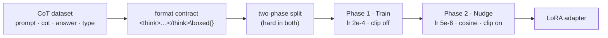

<p align="center">
  
</p>

<p align="center">
  <a href="https://github.com/DaoyuanLi2816/tracedistill/actions/workflows/ci.yml"></a>
  <a href="https://pypi.org/project/tracedistill/"></a>
  
  
  <a href="https://www.kaggle.com/competitions/nvidia-nemotron-model-reasoning-challenge"></a>
</p>

<h1 align="center">tracedistill</h1>

<p align="center"><b>Distill teacher chains-of-thought into a LoRA adapter — so a model re-derives every answer itself, where no code may run.</b></p>

`tracedistill` is the generalized core of team **VCDAD**'s **silver-medal** solution to the
[NVIDIA Nemotron Model Reasoning Challenge](https://www.kaggle.com/competitions/nvidia-nemotron-model-reasoning-challenge)
(**65 / 4182, Top 1.6%**), extracted into a small, tested library you can run on your own
data. The medal-winning code is preserved verbatim in [`competition/`](competition/) and
[pinned to this library byte-for-byte](tests/) by golden tests.

Give it `(problem, teacher chain-of-thought, answer)` triples and it trains a LoRA adapter
that **reasons step-by-step and then emits a parseable `\boxed{}`** — the recipe for tasks
where the grader can't run your code, so the solving procedure has to live inside the
model's own chain-of-thought.

---

## Why not just `SFTTrainer` on your traces?

Four design choices, each implemented as a library piece:

1. **A strict format contract** ([`formatting.py`](src/tracedistill/formatting.py)). The SFT
   target is built byte-for-byte identical to the eval protocol —
   `<think> … </think>\boxed{answer}` — and the reasoning (from the teacher trace) is
   **decoupled** from the final answer (rewritten with the *authoritative* label). Train
   input ≈ eval input, so the model reliably boxes a correct answer instead of trailing off.
2. **Two-phase `Train → Nudge`** ([`training.py`](src/tracedistill/training.py)). A hard,
   fast pass (high LR, clipping off) for broad coverage, then a tiny continuation (1/40 LR,
   cosine, clipping on) that squeezes the hard problem types while a balanced sprinkle of
   *fresh* easy data prevents catastrophic forgetting.
3. **Type-stratified batching** ([`sampling.py`](src/tracedistill/sampling.py)). With a tiny
   effective batch, a naive shuffle can make a whole batch one problem type and swing the
   gradient. A round-robin "deal the cards" order keeps every effective batch type-balanced.
4. **Architecture-aware LoRA** ([`lora.py`](src/tracedistill/lora.py)). The competition base
   is a hybrid **Mamba-2 + MoE** model, so targets cover the SSM `in_proj/out_proj` *and*
   attention *and* MLP — the detail a vanilla Llama recipe misses.


```mermaid
flowchart LR
  D["CoT dataset<br/>prompt · cot · answer · type"] --> F["format contract<br/>&lt;think&gt;…&lt;/think&gt;\boxed{}"]
  F --> S["two-phase split<br/>(hard in both)"]
  S --> P1["Phase 1 · Train<br/>lr 2e-4 · clip off"]
  P1 --> P2["Phase 2 · Nudge<br/>lr 5e-6 · cosine · clip on"]
  P2 --> A["LoRA adapter"]
```

## Install

```bash
pip install tracedistill            # light core: numpy / pandas / pyyaml
pip install "tracedistill[train]"   # + torch / transformers / trl / peft / datasets to train
```

The core (`build_records`, completion-only masking, stratified ordering, data splitting,
target selection, and config validation) is **torch-free** — it imports and unit-tests
without a GPU stack.

## 60 seconds

```python
import tracedistill as td

# Your data: a DataFrame (or list of dicts) with prompt / generated_cot / answer / type.
records, types = td.build_records(df)      # the <think>…</think>\boxed{} format contract
order = td.build_stratified_index_order(types, batch_size=8, seed=42)  # type-balanced order
targets = td.target_modules_from_model(model)   # attention + Mamba SSM + MLP, auto-detected

# Hard rows intentionally appear in both phases; Phase 2's easy rows are a fresh reserve.
phase1_df, phase2_df = td.two_phase_split(df, hard_types=["cryptarithm_deduce"], seed=42)
```

Full two-phase training on an already-LoRA'd model:

```python
from tracedistill import TwoPhaseConfig, PhaseConfig, train_two_phase

cfg = TwoPhaseConfig(hard_types=["cryptarithm_deduce", "cryptarithm_guess"],
                     phase1=PhaseConfig.train(), phase2=PhaseConfig.nudge())
train_two_phase(model, tokenizer, df, cfg)   # Phase 2 continues from Phase 1's weights
```

## CLI

One YAML config drives an end-to-end run (load base model → architecture-aware LoRA →
`Train → Nudge` → save / package the adapter):

```bash
tracedistill --cfg examples/configs/quickstart.yaml             # small single-GPU
tracedistill --cfg examples/configs/reproduce_competition.yaml  # the medal setup (Kaggle)
tracedistill --cfg examples/configs/quickstart.yaml --dry-run   # validate data/split, no GPU
```

## Measured: does distilling the *trace* actually help? (GSM8K, one RTX 4080)

[`examples/gsm8k_trace_distillation.py`](examples/gsm8k_trace_distillation.py) runs four
arms on a **base (non-instruct) Qwen2.5-0.5B + LoRA** through the public API and scores
**boxed-answer accuracy** on held-out GSM8K (greedy, parse `\boxed{}` exactly like a
grader). Every trained arm uses completion-only labels: the prompt is excluded from the
loss at the token boundary. The answer-only and one-phase trace arms use the same
initialization and optimizer settings; the reasoning trace between the `<think>` tags is
their only training-target difference.

<p align="center">
  
</p>

| arm | boxed accuracy | parse rate | hard-problem acc (≥5 steps) |
|---|--:|--:|--:|
| zero-shot (base, no training) | 13.0% | 33.0% | 6.1% |
| answer-only SFT | 10.0% | 100.0% | 3.0% |
| **trace-distill, 1 phase** | **31.5%** | 99.5% | 3.0% |
| **trace-distill, 2 phase (Train→Nudge)** | **33.0%** | 99.0% | **12.1%** |

**The trace is the signal.** With nearly identical parse rates, one-phase trace
distillation beats answer-only SFT by **21.5 percentage points** (31.5% vs 10.0%). The
two-phase recipe reaches **33.0%**, about **2.5×** the 13.0% zero-shot accuracy.

**Formatting and solving separate cleanly.** Answer-only SFT reaches a 100% parse rate but
only 10.0% accuracy: learning to emit `\boxed{}` is not enough. Both trace arms retain
~99% parse rates while tripling the answer-only accuracy.

**Nudge targets the tail.** The hard-focused second phase moves overall accuracy from
31.5% to 33.0%, while ≥5-step accuracy rises from 3.0% to 12.1%. Because the two-phase
arm also changes the data schedule, this is a recipe comparison rather than an isolated
causal estimate of the Nudge step.

The complete run uses one seed and 200 held-out examples on a 0.5B model. Exact package
versions, hardware, data fingerprints, commit, and per-bucket results are in the
[machine-readable result](results/gsm8k-qwen2.5-0.5b-v0.2.0.json) and
[reproducibility notes](docs/reproducibility.md).

```bash
pip install "tracedistill[train]" datasets
python examples/gsm8k_trace_distillation.py        # ~45 min on one RTX 4080 (16 GB)
```

## The competition result

On the hidden test set, the two-phase recipe on `Nemotron-3-Nano-30B-A3B` reached a
**silver medal (65 / 4182, Top 1.6%)**. ~84% of the benchmark is "free" points that almost
everyone clears (gravity, unit conversion, Roman numerals, ciphers); the ranking is decided
by two hard families — **cryptarithm** and **bit-manipulation** — which is exactly what the
two-phase `Nudge` and the hard/easy split target. See [`docs/solution.md`](docs/solution.md),
[`docs/dataset.md`](docs/dataset.md) and [`docs/model-card.md`](docs/model-card.md) for the
full methodology, and [`competition/`](competition/) for the verbatim solution.

## How it compares

| | naive `formatting_func` SFT | `tracedistill` |
|---|---|---|
| Loss target | full rendered conversation | assistant completion only |
| Target format | freeform text | strict `<think>…</think>\boxed{}` contract |
| Answer source | as written in the trace | decoupled — official label re-boxed |
| Schedule | single pass | two-phase `Train → Nudge` |
| Batching | shuffle | type-stratified round-robin |
| LoRA targets | attention (+ MLP) | + **Mamba-2 SSM** `in_proj/out_proj` |

## Provenance & validation

- [`competition/`](competition/) — the original silver-medal solution, **unmodified**.
- [`tests/`](tests/) — **golden tests**: `tests/reference_impl.py` holds verbatim copies of
  the competition's `build_records` / `build_stratified_index_order`, and the suite asserts
  `tracedistill` reproduces them **byte-for-byte** over hundreds of fuzzed cases. The 50+
  light-core tests run in well under a second; the optional training layer has a separate
  compatibility job.

The official Kaggle **Certificate of Achievement** — Silver Medalist, 65th of 4182 teams:

<p align="center">
  <a href="https://www.kaggle.com/certification/competitions/distiller/nvidia-nemotron-model-reasoning-challenge"></a>
</p>

## Citation

```bibtex
@misc{li2026tracedistill,
  title  = {tracedistill: Two-Phase LoRA Trace-Distillation for Reasoning Models},
  author = {Li, Daoyuan},
  year   = {2026},
  note   = {Silver medal (65/4182), NVIDIA Nemotron Model Reasoning Challenge},
  url    = {https://github.com/DaoyuanLi2816/tracedistill}
}
```

## License

[MIT](LICENSE). The license covers the code and documentation in this repository; it does
**not** extend to the competition data or the base model, which remain under their
respective terms (see [`data/README.md`](data/README.md)).
